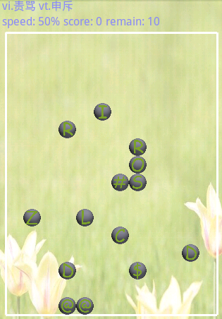
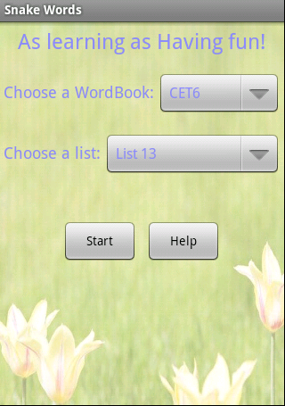

程序名称：Snake
================

###SDK版本号：2.2

----------------------------

###程序简介：

本程序将经典的贪食蛇游戏与背单词相结合，蛇必须按单词顺序吃豆，组成一个单词。游戏开始前玩家先将10个单词记忆一遍，然后进入背单词游戏，玩家根据单词的中文释义，回忆单词的拼写，然后控制蛇依次吃带有字母的豆。所吃的豆组成单词后再吃一颗带有"$"号的豆，程序将判断所吃的豆是否正确。如果在吃的过程中误吃了豆，则可以吃一颗带有"@"号的豆，这将会删除蛇最近吃的一颗豆。

-------------------------------

###程序详细介绍：

 程序分为两大模块，单词模块(Word.java, DIC.java)和游戏模块(TileView.java, SnakeView.java, Snake.java, Start.java)。单词模块建立了一个单词数据库，向游戏模块提供数据。游戏模块负责游戏的控制，动画显示等。

-------------------------------

###游戏截图

